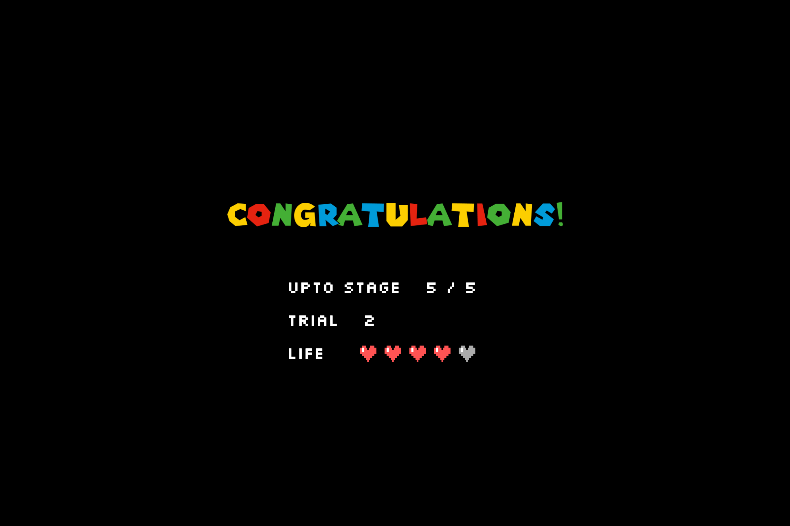

# Individual Project - Video Game in Javascript

| **Name**                               | Seungyeon Choi                        |
| :------------------------------------- | :------------------------------------ |
| **Student ID**                         | 20190656                              |
| **Github Repository**                  | https://github.com/nsy033/ID311_Mario |
| **Deployed Link** (Chrome Recommended) | https://id311-mario.web.app/          |
| **Demo Video**                         | https://youtu.be/Jmr3pcJfYNQ          |

---

## Contents
- [Description](#description)
  - [Target Game](#target-game)
  - [Map Components](#map-components)
  - [Rule and Interface](#rule-and-interface)
- [Code Organization](#code-organization)
  - [Class Diagram](#class-diagram)
  - [Design Patterns](#design-patterns)
- [Issues](#issues)
- [Resources](#resources)
---

## Description

### Target Game

- My target game is *Mario Gravity Adventure*, a game in which *Mario* moves through the direction keys and SPACEBAR, changing the direction of gravity, moving toward the star.
  
|  |  |
| :-------------------------------------------------------------- | :-------------------------------------------------------------- |
|  |  |
|  |  |

### Map Components
|  |  |  |  |  |  |  |  |
| :--------------------------------------------------------------- | :---------------------------------------------- | :--------------------------------------------------- | :----------------------------------------------- | :----------------------------------------------- | :---------------------------------------------- | :----------------------------------------------- | :--------------------------------------------------------- |
| Sprites of *Mario*                                               | Star                                            | Block for Star                                       | Normal Block                                     | Block with Grass                                 | Fire                                            | Thorn                                            | Pipe                                                       |

### Rule and Interface

- *Mario* can basically move the map using the **keyboard direction keys (up, left, down, and right)**. When *Mario* finally reaches the star, each stage is completed.
- Brick or grass means the safe part even if he steps on it or touch it, and the part with fire or thorn means should not be touched.
- In this game, *Mario* cannot do JUMP, such like the physical world. Instead, *Mario* changes the direction of gravity.
- There are two ways *Mario* can change the direction of gravity on him.
  - When the player **presses SPACEBAR**, *Mario*'s gravity becomes exactly the opposite of the previous direction.
    - For example, if the player presses SPACEBAR while *Mario* standing on the floor, *Mario* will have to step on the ceiling, as shown in the picture a) below.
    - When *Mario*'s direction of gravity changes, he floats in the air for a while toward a new floor according to gravity.
    - The player can use **keyboard direction keys** to move in directions perpendicular to gravity (left or right) while *Mario* floats toward the next floor.
  - When *Mario* meets the pipes while floating, *Mario*'s gravitational direction rotates 90 degrees either clockwise or counterclockwise.
    - In other words, if the player presses SPACEBAR and *Mario* meets the pipes while floating up, the direction that was previously "up" will be changed to "right" or "left", and *Mario* will then float toward the "right" or "left" wall until it is made to as a new floor.
    - Which pipe rotates *Mario* clockwise or counterclockwise can be found in the pictures b) and c) below.

|  |  |  |
| :--------------------------------------------------------- | :--------------------------------------------------------- | :--------------------------------------------------------- |
| a) Mario stepping on the ceiling                           | b) Pipe which rotates *Mario* clockwise                    | c) Pipe which rotates *Mario* counterclockwise             |

## Code Organization

### Class Diagram

### Design Patterns

**Object-Oriented-Programming**

- I have tried to consider each of *Mario*, brick, fire, star, ... as object playing their respective roles.
- For instance, Mario has ...
  - attributes like image of himself, which direction he is facing, etc.
  - methods like move (to his facing direction), receiveGravity (), etc.

**MVC**

- Mario is moving according to the keyboard-pressing event. As we have learned in class, it could lead to jittering if the event handling and rendering of the screen are not distinguished properly.
- Therefore, I have adopted an approach that separates the model, view, and controller. So, for example, as we can see the codes in *main.js*, I have tried to separate the drawing and each algorithmic parts about controlling data.

**Singleton**

- Inside each map, there is only one *Mario*. In a similar manner, there is no need for GameManager and MapFactory to be constructed repeatedly. Rather it would be good to only generated at the very first time and use that instance again from the next needs. Therefore, I have tried to utilize the Singleton design pattern.

**Subject-Observer**
- I have tried to use the Subject-Observer pattern to enable *Mario* and each object to message with each other.
- Most of the time, the notification occurs for detecting any collision, whenever *Mario* tries to moves to somewhere. Everything on the map then checks where *Mario* moved to, and verifies that whether it collides with itself. If Mario collides with itself, it informs *Mario* again about the collision. Then *Mario* is going to know that he cannot move to that position as it's blocked.
- If the object where the collision with *Mario* is detected is an obstacle, such as a thorn or fire, or the *Mario*'s goal, a star, then the notification from the object is sent also to the GameManager. Through this notification, the GameManager will be able to know the current progress of the game, whether it is a game over or if the stage has been cleared.
- For example, let's think about a situation that Mario wants to move to a certain coordinate which is going to overlap with a block. Their messaging will looks like ...
  1.   *Mario* : I want to move to here (x, y)
  2.   Block : Then you'll bump into me. You cannot go there
  3.   *Mario* :  Okay, I see

---

## Issues
- I implemented this based on Chrome, but when running on Safari, the screen seems to have a much longer time interval to re-render; Mario moves very slowly.
- Collision detection was implemented on my own, and sometimes, even though I tried to calibrate as much as possible, the criteria for being judged to have collided with fire or thorn may feel too strict.

## Resources
- Original Sound Tracks 
  - https://downloads.khinsider.com/game-soundtracks/album/super-mario-64-soundtrack
- Sound Effects
  - https://www.myinstants.com/ko/index/kr/
